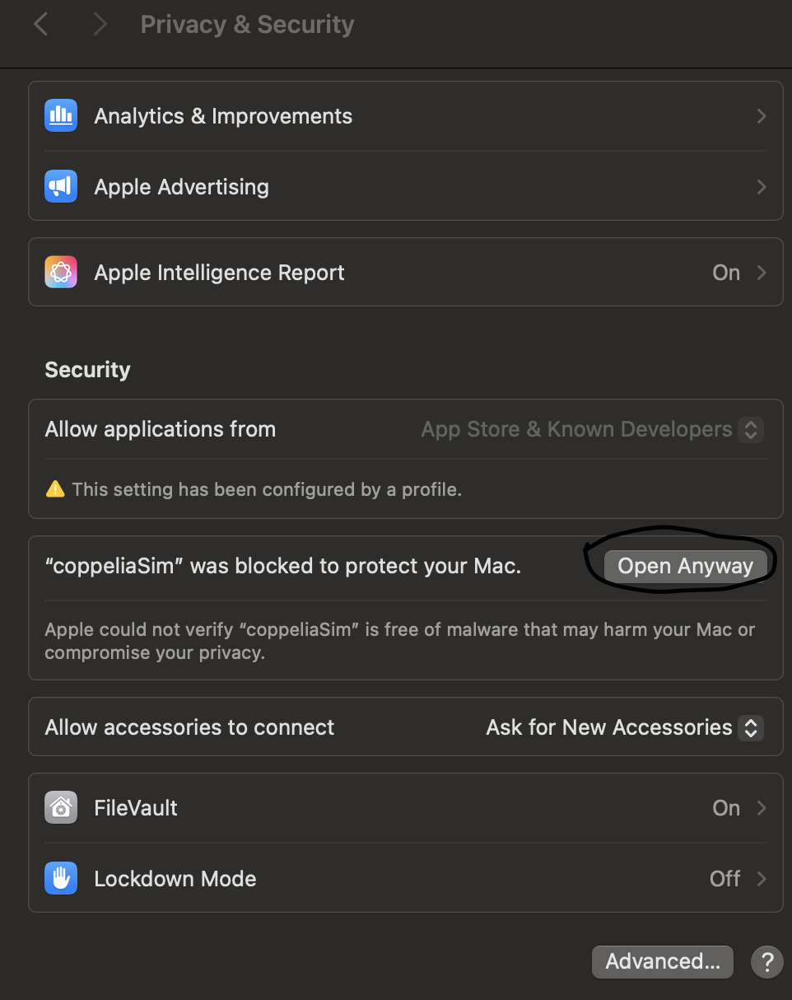

# Installing and Running CoppeliaSim

## For Linux 22.04 

### Step 1: Download CoppeliaSim
- Visit the official website: [Coppelia Robotics](https://www.coppeliarobotics.com)
- Download educational `CoppeliaSim V4.7.0` suitable for your operating system.

### Step 2: Locate the Downloaded File
- By default, the file is downloaded to the `Downloads` folder.
- The file should be named: `CoppeliaSim_Edu_V4_1_0_Ubuntu20_04.tar.xz`

### Step 3: Open Terminal
- Navigate to the folder where the file is located (e.g., `Downloads`).
- Use the shortcut `Ctrl` + `Alt` + `T` to open a terminal in Linux.

### Step 4: Extract and Run CoppeliaSim
```shell
cd Downloads
# Extract the tar.xz file into a folder
tar -xf CoppeliaSim_Edu_V4_1_0_Ubuntu20_04.tar.xz

cd CoppeliaSim_Edu_V4_1_0_Ubuntu20_04
# Run CoppeliaSim
./coppeliaSim.sh
```

You can now use CoppeliaSim on your system.

## For Mac (Arm64)


### Step 1: Download CoppeliaSim
- Visit the official website: [Coppelia Robotics - Previous Versions](https://www.coppeliarobotics.com/previousVersions)
- Download `CoppeliaSim V4.7.0` suitable for your operating system. or any latest version 

### Step 2: Locate the Downloaded File
- By default, the file is downloaded to the `Downloads` folder.
- The file should be named: `CoppeliaSim_Edu_V4_1_0_Ubuntu20_04.tar.xz`
- double click to extract

### Step 3: Add to applications 
- Add the coppeliasim file to application

### (Optional) Step 4: Extract and Run CoppeliaSim

if error : Apple could not verify “coppeliaSim” is free of malware that may harm your Mac or compromise your privacy.



- click on that giving admin access.
- then click on coppeliaSim in the Application
